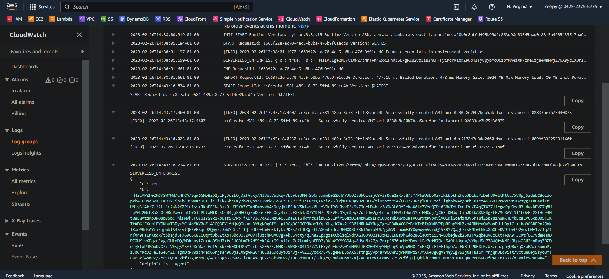

# LAMBDA FUNCTION TO CREATE WEEKLY EC2 AMI BACKUP


[Project Source](https://devopsrealtime.com/deploy-lambda-function-to-create-weekly-ec2-ami-backup/)


## Goal
The goal of this project to create weekly EC2 AMI backup of all EC2 instances running in the us-east-1 region and delete AMIs older than 30 days.

## Instructions
### Step 1: Create EC2 instances and Amazon Simple Notification Service

* Create EC2 instances with tag: Name 

* On the AWS Management Console, navigate to the SNS console.
  
* Enter a name for the topic click on "Create topic" button.

* Once the topic has been created, select it from the list of topics.

* Click on the "Create subscription" button, select "Email" from the Protocol drop-down menu, enter your email address in the Endpoint field. and click on "Create subscription" button. AWS will send an email to the email address you entered in. Open the email and click on the confirmation link to confirm the subscription.


### Step 2
* Clone the repository
    ```
    git clone https://github.com/0xceejay/lambda-function-for-ec2-ami-backup.git
    ```

* Edit the Topic Arn for the topic just created
* Run `sls login` to login to serverless dashboard
    ```
    sls login
    ```
  
  

* Run `sls deploy` to deploy lambda function to AWS as a cloudformation stack
    ```
    sls deploy
    ```
  
  - Check on AWS console to see the deployed function and cloudformation stack
  
* Run `sls invoke -f myFunction` to invoke the function
    ```
    sls invoke -f myFunction
    ```
  
  - Check on AWS Cloudwatch menu to see the log groups and the stream
  
  

  - Check email for notification
  


* Run `sls remove` to destroy any provided resources
    ```
    sls remove
    ```
    
